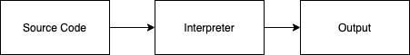

## Python 🐍: Getting to know your environment

### What is Programming?

At the core, programing is about solving problems using computers. It gives humans the ability to automate tasks, gather information, and perform actions based on that information.

### What is Python?

Python is a dynamically typed, interpreted high-level and general purpose programming language. Python was modeled after the English language, making it easier for people to read and understand.

Python was first released in 1991 by Guido Van Rossum. He named the language after the British comedy group Monty Python.

### Dynamically typed

What does it mean to be a dynamically typed language? Dynamic typing refers to the ability to create variables (stored information) without having to declare the type (number, text, list, etc).

This provides flexiblity and freedom when writing programs. However, it can lead to risky code that can be difficult to debug if a programmer is not careful.

### Interpreted Language

In order to run a Python program on a computer the code must be interpreted. When you click run on a Python program, the python code is first converted into **bytecode**. Bytecode is a set of instructions can the interpreter can excute.

This allows for programmers to run programs that are platform-independent (Windows, MacOS, etc) because all you need is the Python interpreter.



### Why Python?

Python is known for being a great beginner programming language. Students can take what they learn and apply it other programming languages and technologies. Just because it is a great beginner langauage doesn't mean it isn't widely used in many industries. Python is used in web programming, artifical intelligences, video games, and even movies.

### Download Python

Follow this [link](https://www.python.org/downloads/) and download the latest Python installer for your operating system.

### Install Python

Follow the instructions from the install to set up Python on your computer.

**Note:** Windows users need to make sure the Add Python to path option is selected during installation.

### Python Syntax

Syntax is the set of rules of a language. The Python interpreter uses indentations to understand the intention of the program.

```python
if 1 == 1:
    print("1 is equal to 1")
```

This example code will print the text `1 is equal to 1` since `1 == 1 `evaulates to true. Notice how the line starting with `print` is indented. If there was no indentation the interepter would throw a syntax error and the program would exit.

```python
if 1 == 1:
print("This is a syntax error")
```

If you every encounter a syntax error it means the interpreter could not understand the code. The programmer will be responsible for following the rules of the language.

### REPL

The REPL, which stands for Read-Evaluate-Print-Loop, is an interactive programming environment which allows single statement to be executed. It is useful when a programmer wants to quickly test out a line of code for correctness.

### First Program

Search your computer and launch the application `IDLE3`. You will see a window with a prompt (`>>>`).

Type `print('hello, world!')` into that application and press enter.

Congratulations!🎉 you have wrote your first Python program.

### Suggested Projects

- Change the program to say hi, world!
- Change the program to say hi to your name
- print your favorite song lyrics to the screen
